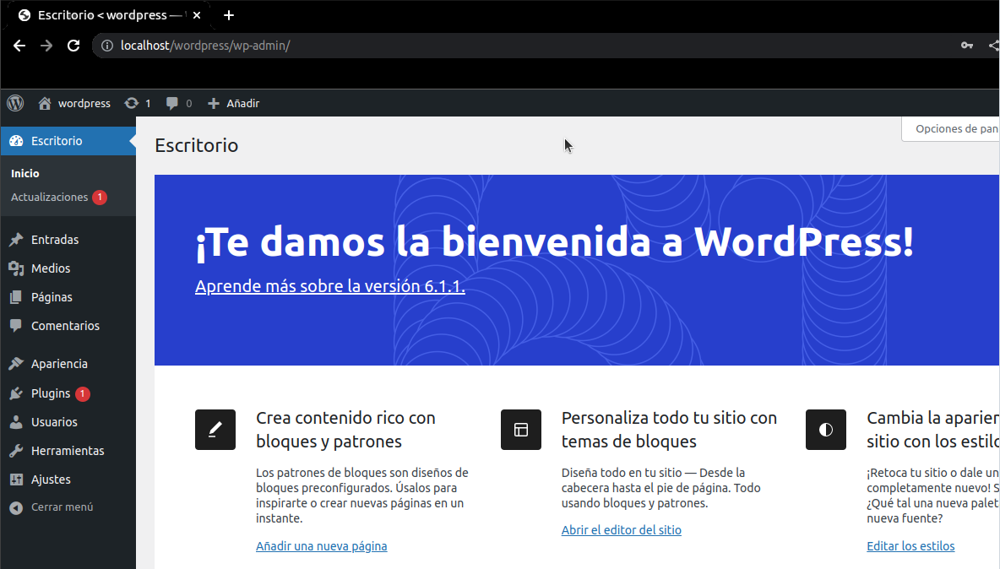
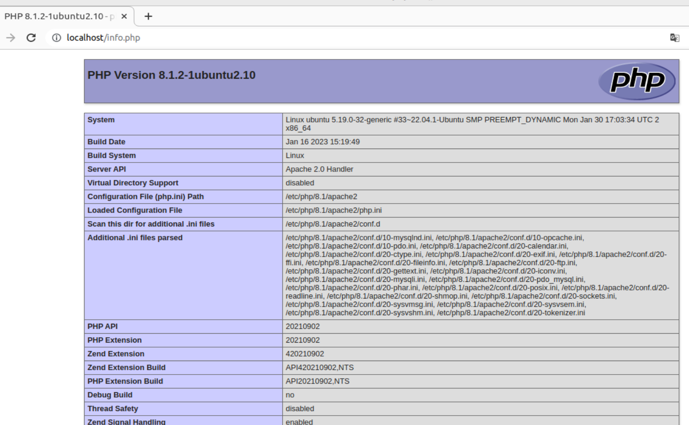
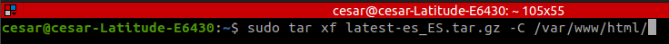
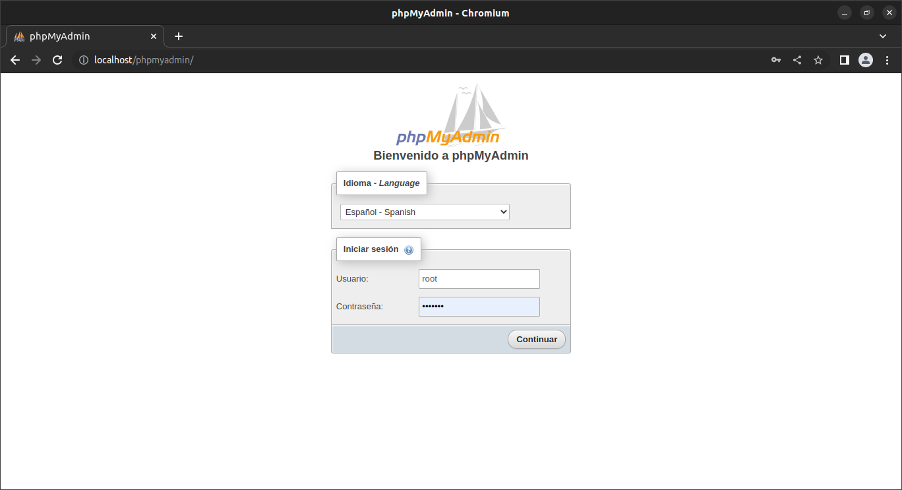
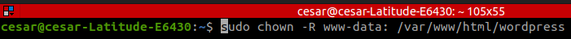
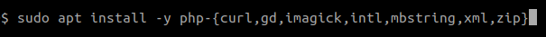
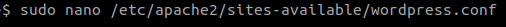
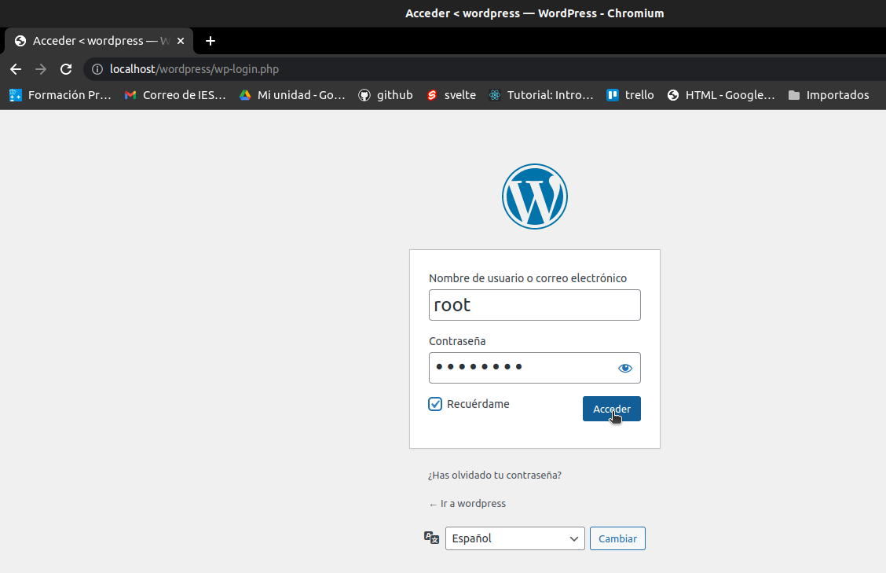

# Guía de instalación LAMP y WordPress.
:toc: left
:toc-title: Indice de contenidos


Esta es una guía acerca de cómo instalar _Wordpress_ en _Ubuntu_ 20.04 _LTS_, deseamos que la documentación aportada sea de utilidad para otros usuarios y, también, sirva para mejorar las habilidades en el uso de _Markdown_ y _GitHub_.


---
---

 


Millones de personas en todo el mundo utilizan este potente _CMS_ de código abierto para crear _blogs_ y sitios _web_ totalmente funcionales. La simplicidad de _Wordpress_ permite, incluso para quienes no tienen experiencia previa en diseño o desarrollo _web_, llevar a cabo proyectos de cierta envergadura.

Dispone de una amplia variedad de _themes_ y _plugins_ que te permitirán personalizar tu _web_.

Hay muchas formas de acceder a _WordPress_ para gestionar y modificar tus _webs_. No obstante, en algunos casos, los usuarios no informáticos tienen ciertas dificultades en la instalación y configuración de este _CMS_ debido a determinados requisitos.

En esta guía te ayudaremos en la instalación y configuración de _WordPress_ en _Ubuntu_ 20.04 _LTS_.

---


== 1.Instalación de LAMP.

---
---

### 1.1. Introducción a LAMP.

Un stack es un conjunto de herramientas de software agrupadas que impulsa los sitios web dinámicos y aplicaciones web, en el caso de LAMP son:

 * *L* inux. Sistema Operativo.
 * *A* pache HTTP Server_. Plataforma destinada a la creación de un servidor _web_.
 * *M* ariaDB / MySQL. Sistemas de gestión de bases de datos.
 * *P* HP. Intérprete del lenguaje de programción _php_, necesario para visualizar las _webs_ dinámicas.

Todos son de código abierto y gratuíto.

Realizaremos los pasos desde un Terminal.
Para ello utilizaremos la orden sudo (super user do) asegurandonos de que tenemos los permisos necesarios para realizar la instalación. Si en algún momento alguno de los comandos no funciona, escribiremos sudo delante de todo y volvemos a insertar el comando.


### 1.2. Primeros pasos.


Abrimos el terminal (_shell_); también, pulsando teclas&nbsp;&nbsp; `Alt + Ctrl + T`&nbsp; y procedemos a tomar control del sistema como superusuario (_root_), empleando los siguientes códigos; según sea la situación:

1.- En caso de conocer la contraseña del superusuario (_root_):
```
su -

Contraseña:


```
Uno de los sistemas de seguridad que caracterizan a los sistemas Linux es que los password no se van a enseñar en pantalla, por lo que aunque no lo parezca estamos escribiendolo.

2.- En caso de desconocer la contraseña del superusuario (_root_) y sólo disponer de la contraseña del usuario:

```
sudo -i

[sudo] contraseña para nombre_del_usuario:


```

Antes de continuar realizaremos la actualización del _software_ instalado en la computadora:

```
 apt update && apt upgrade -y

```
El añadido _-y_ es para que no pida una autorizacion y lo realice en segundo plano.

---

### 1.3. Instalación de Apache HTTP Server.


Procedemos a instalar _Apache HTTP Server_ y un paquete de herramientas adicionales que son necesarias:

```
 apt install -y apache2 apache2-utils
```

A continuación, ejecutamos la siguiente orden, de modo que, ahora nuestra computadora pueda realizar tareas como servidor:

```
 systemctl start apache2

```

Nos debería aparecer una pantalla donde nos indique apache2.service y que está activo (running).

De todas formas para comprobarlo escribiremos:


```
 systemctl status apache2
```
Si el servicio está ejecutándose correctamente, el terminal debería mostrarnos algo así:

```
● apache2.service - The Apache HTTP Server
     Loaded: loaded (/lib/systemd/system/apache2.service; enabled; vendor prese>
     Active: active (running) since Thu 2023-02-23 09:11:17 CET; 4h 7min ago
       Docs: https://httpd.apache.org/docs/2.4/
   Main PID: 1088 (apache2)
      Tasks: 6 (limit: 9406)
     Memory: 19.0M
        CPU: 1.039s
     CGroup: /system.slice/apache2.service
             ├─1088 /usr/sbin/apache2 -k start
             ├─1118 /usr/sbin/apache2 -k start
             ├─1119 /usr/sbin/apache2 -k start
             ├─1120 /usr/sbin/apache2 -k start
             ├─1121 /usr/sbin/apache2 -k start
             └─1122 /usr/sbin/apache2 -k start

feb 23 09:11:16 nombre_de_la_computadora systemd[1]: Starting The Apache HTTP Server...
feb 23 09:11:17 nombre_de_la_computadora systemd[1]: Started The Apache HTTP Server.
```

Para que se inicialice al arrancar escribiremos lo siguiente:

```
sudo systemctl enable apache2
```
Si abrimos un navegador, como _Mozilla Firefox_ y escribimos en la barra de búsqueda, alguna de las siguientes direcciones:

+ localhost
+ localhost:80
+ localhost:8080

Debe mostrar una página similar a esta:


 
image::assets/imgs/apache_works.png[apache_works, 600,600]

---

### 1.4. Instalación de MariaDB.


En esta guía, como parte del LAMP, se instalará _MariaDB_ de la siguiente manera:

```
 apt-get install mariadb-server
```

A continuación,  se inicia el servicio de _MariaDB_ y estableceremos el inicio automatico:

```
 systemctl start mariadb

 systemctl enable mariadb
```


Comprobamos que el servicio esté ejecutándose:

```
 systemctl status mariadb
```
Si todo está correcto el terminal debería mostrarnos algo así:

```
● mariadb.service - MariaDB 10.6.12 database server
     Loaded: loaded (/lib/systemd/system/mariadb.service; enabled; vendor preset: enabled)
     Active: active (running) since Thu 2023-02-23 16:15:18 CET; 5h 51min ago
       Docs: man:mariadbd(8)
             https://mariadb.com/kb/en/library/systemd/
    Process: 1185 ExecStartPre=/usr/bin/install -m 755 -o mysql -g root -d /var/run/mysqld (code=exited, status=0/SUCCESS)
    Process: 1207 ExecStartPre=/bin/sh -c systemctl unset-environment _WSREP_START_POSITION (code=exited, status=0/SUCCESS)
    Process: 1212 ExecStartPre=/bin/sh -c [ ! -e /usr/bin/galera_recovery ] && VAR= ||   VAR=`cd /usr/bin/..; /usr/bin/galera_recovery`; [ $? -eq 0 ]   && systemctl set-environment _WSREP_START_POS>
    Process: 1299 ExecStartPost=/bin/sh -c systemctl unset-environment _WSREP_START_POSITION (code=exited, status=0/SUCCESS)
    Process: 1301 ExecStartPost=/etc/mysql/debian-start (code=exited, status=0/SUCCESS)
   Main PID: 1258 (mariadbd)
     Status: "Taking your SQL requests now..."
      Tasks: 8 (limit: 18848)
     Memory: 90.3M
        CPU: 3.765s
     CGroup: /system.slice/mariadb.service
             └─1258 /usr/sbin/mariadbd

feb 23 16:15:18 nombre_de_la_computadora mariadbd[1258]: Version: '10.6.12-MariaDB-0ubuntu0.22.04.1'  socket: '/run/mysqld/mysqld.sock'  port: 3306  Ubuntu 22.04
feb 23 16:15:18 nombre_de_la_computadora systemd[1]: Started MariaDB 10.6.12 database server.
feb 23 16:15:18 nombre_de_la_computadora /etc/mysql/debian-start[1303]: Upgrading MySQL tables if necessary.
feb 23 16:15:18 nombre_de_la_computadora /etc/mysql/debian-start[1306]: Looking for 'mariadb' as: /usr/bin/mariadb
feb 23 16:15:18 nombre_de_la_computadora /etc/mysql/debian-start[1306]: Looking for 'mariadb-check' as: /usr/bin/mariadb-check
```
Después de la instalación del servidor vamos a instalar su seguridad:
```
sudo mysql_secure_installation
```
Al insertar este comando nos aparecerá un documento que tendremos que leer con atención.

Para efectuar la seleccion de alguna de las opciones pulsaremos la barra espaciadora.

Cuando pida la contraseña del root simplemente presionamos enter, ya que aún no la tenemos configurada.

A continuación, proseguirá una secuencia como esta, en la que presionaremos `Intro` después de escribir `Y`.

```
By default, a MariaDB installation has an anonymous user, allowing anyone
to log into MariaDB without having to have a user account created for
them. This is intended only for testing, and to make the  installation
go a bit smoother. You should remove them before moving into a
production environment.

Remove anonymous users? [Y/n] Y
 ... Success!

Normally, root should only be allowed to connect from 'localhost'. This
ensures that someone cannot guess at the root password from the network.

Disallow root login remotely? [Y/n] Y

By default, MariaDB comes with a database named 'test' that anyone can
access. This is also intended only for testing, and should be removed
before moving into a production environment.

Remove test database and access to it? [Y/n] Y
 - Droping test database...
 ... Success!
 - Removing privileges on test database...
 ... Success!

Reloading the privileges tables will ensure that all changes made so for
will take effect immediately.

Reload privileges tables now? [Y/n] Y
  ... Success!

Cleaning up...

All done! If you've completed all of the above steps, your MariaDB
installation should be now be secure.

Thanks for using MariaDB!
```

Por defecto MariaDB en Ubuntu te permite trabajar con el usuario root sin la contraseña, para iniciar sesión en el terminal:
```
sudo mariadb -u root
```
Para salir: 
```
exit; 
```
Debemos acordarnos del  " *;* " al final de cada sentencia para que realice la instrucción.

Para comprobar la información de la versión de MariaDB:
```
mariadb --version
```
---

### 1.5. Instalación de PHP.

Aunque el sistema operativo ya trae preinstalado un interprete de _PHP_ instalaremos la versión 7.4 de _PHP_, por cuestiones de compatibilidad, desde el terminal como superusuario (_sudo_):

```
 apt install php7.4 libapache2-mod-php7.4 php7.4-mysql -y
```
Para asegurarnos un correcto funcionamiento de _WordPress_ necesitamos la instalación de algunos módulos adicionales:

```
 apt install php-curl php-gd php-mbstring php-xml php-xmlrpc php-soap php-intl php-zip -y

```
Y los habilitaremos con:
```
 a2enmod php7.4
```
Una vez finalizada la instalación reiniciamos el servicio de _Apache HTTP Server_:

```
 systemctl restart apache2
```
En el caso de _PHP_ crearemos un archivo con la finalidad de comprobar si funciona correctamente el _package_ instalado y le insertaremos el código:

```
 cd /
 cd var/www/html/
 nano info.php
```
image::assets/imgs/info_php.png[info_php, 600,600]


Una vez guardado (`Ctrl + O`), salimos del editor _nano_ (`Ctrl + X`), abrimos el navegador y en la barra de direcciones escribimos lo siguiente (ambas opciones son válidas):
```
127.0.0.1/info.php
```
o si preferimos
```
localhost/info.php
```




Se recomienda como medida de seguridad una vez comprobado que funciona la eliminación del archivo `info.php`:
```
cd /var/www/html/

rm info.php
```

== 2. Instalación de WordPress.

---
Usamos el comando wget para descargar y archivar el enlace con la página web de descargas de wordpress, en idioma español (https //wordpress.org/latest-es_ES.tar.gz)

```
wget https://es.wordpress.org/latest-es_ES.tar.gz
```
image::assets/imgs/wordpress_instalacion.png[wordpress1, 600,600]
image::assets/imgs/wordpress_instalacion2.png[wordpress2, 600,600]

Para poder utilizar el archivo .tar que hemos guardado debemos proceder con los dos siguientes comandos:

Primero descomprimimos el archivo en la carpeta que nos interesa
```
sudo tar xf latest-es_ES.tar.gz -C var/www/html
```
A continuacion tomamos posesion de la carpeta para poder utilizarla libremente
```
sudo chown -R www-data: /var/www/html/wordpress
```



Una vez hemos realizado estes pasos, es el momento de preparar la base de datos que utilizará Wordpress.
Podemos hacerlo con un interfaz grafico como por ejemplo _PhpMyAdmin_ 



o mediante la linea de comandos, para lo que debemos conectarnos a nuestro _SGBD_, en este caso a _MariaDB_:

```
mysql -u root -p
```


Creamos la Base de Datos:
```
create database wordpress charset utf8mb4 collate utf8mb4_unicode_ci;
```
image::assets/imgs/wordpress_instalacion5.png[wordpress5, 600,600]

Creamos el usuario que podrá gestionar la Base de Datos:
```
create user wordpress@localhost identified by ‘xxxxxxxxx’;
```
image::assets/imgs/wordpress_instalacion6.png[wordpress6, 600,600]

Le asignamos los permisos necesarios al usuario que acabamos de crear:
```
grant all privileges on wordpress.* to wordpress@localhost;
```
image::assets/imgs/wordpress_instalacion7.png[wordpress7, 600,600]

Por último, configuraremos en Apache nuestro sitio de Wordpress con los siguientes pasos:
```
sudo apt install -y php-{curl,gd,imagick,intl,mbstring,xml,zip}
```
image::assets/imgs/wordpress_instalacion8.png[wordpress8, 600,600]

```
sudo apt install -y php8.1-{curl,gd,imagick,intl,mbstring,xml,zip}
```
(o la versión php7.4, según compatibilidad)

image::assets/imgs/wordpress_instalacion10.png[wordpress10, 600,600]

Instalamos los complementos necesarios para el funcionamiento con php:



A continuacion necesitamos recargar el servicio de apache2 para que funcionen los cambios:
```
sudo systemctl reload apache2
```
image::assets/imgs/wordpress_instalacion11.png[wordpress11, 300,300]

Y habilitamos la reescritura del archivo:
```
sudo a2enmod rewrite
```
image::assets/imgs/wordpress_instalacion12.png[wordpress12, 400,400]

Editamos el archivo: 
```
sudo nano /etc/apache2/sites-available/wordpress.conf
```



e insertamos lo siguiente:
```
<Directory /var/www/html/wordpress>
AllowOverride all
</Directory>
```

Una vez guardados los cambios vamos a habilitarlo:
```
sudo a2ensite wordpress.conf
```
image::assets/imgs/wordpress_instalacion15.png[wordpress15, 300,300]


Finalmente sólo nos quedaría volver a reiniciar el servicio de Apache2 para que se hagan efectivos los cambios:
```
sudo systemctl restart apache2

```
image::assets/imgs/wordpress_instalacion16.png[wordpress16, 300,300]

Ahora podemos acceder desde un navegador web a nuestra ip/wordpress para acabar la configuración desde el instalador web.

image::assets/imgs/wordpress_instalacion17.png[wordpress17, 600,600]

Una vez cubiertos los datos que nos solicitan enviamos la información.

image::assets/imgs/wordpress_instalacion18.png[wordpress18, 600,600]

Y finalmente instalamos wordpress.

image::assets/imgs/wordpress_instalacion19.png[wordpress19, 600,600]

Ahora ya podemos acceder a wordpress con nuestros datos personales al sitio de administracion



para comenzar a crear nuestra página web.

image::assets/imgs/wordpress_instalacion21.png[wordpress21, 600,600]

== Información acerca de los autores.


* José María Antón Pequeno | antonpequeno@gmail.com
* Juan Carlos López García | juanc.doa@gmail.com
* María Jesús  Bra Rodríguez | chusprogramacion@gmail.com
* Francisco José Calviño García | frjcgarcia@gmail.com
* Javier Caeiro Canabal | jcaeiroc@gmail.com
* César Leal Pérez | cesarldev@gmail.com


---