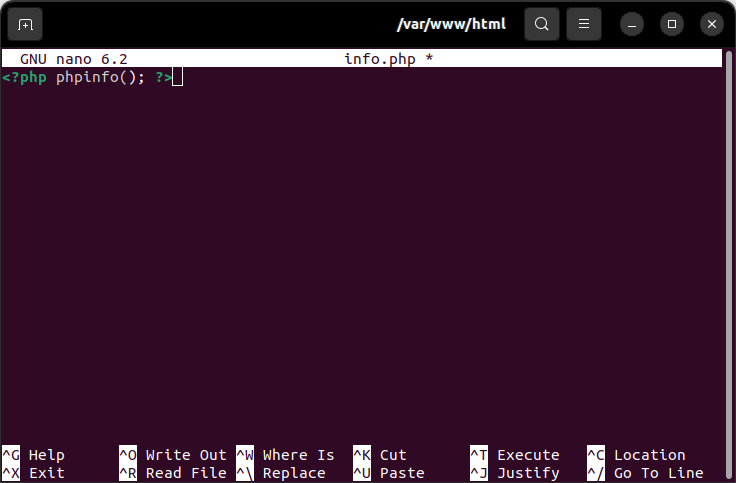
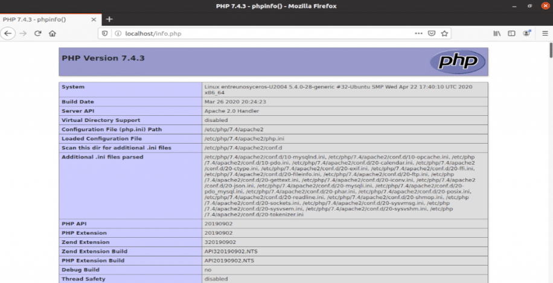

## **3. Configuración de LAMP.**

---

<br>

Este apartado comprenderá una serie de pasos necesarios para que, posteriormente, funcione el _CMS_ _WordPress_.

En primer lugar, “regresamos al apartado” del _RDBMS_. Esto se debe a que se recomienda, encarecidamente, que se ejecute un programa de seguridad con objeto de eliminar la configuración predeterminada insegura y proteger las bases de datos.

```
root@nombre_la_computadora:~# mysql_secure_installation

NOTE: RUNNING ALL PARTS OF TIRIS SCRIPT IS RECOMMENDED FOR ALL MariaDB
      SERVERS IN PIOXICTION USEI PLEASE READ EA. STEP CAREFULLY!. 

In order to log into MariaDB to secure it, we'll need the current password for the root user. If you've just installed MariaDB, and you haven't set the root password yet, the password will be blank, so you should just press enter here.

Enter current password for root (enter for none):
OK, successfully used password, moving on... 

Setting the root password ensures that nobody can log into the MariaDB
root user without the proper authorisation.

Set root password? [Y/n] Y 
New password:
Re-enter new password:
```
---
**Nota.**

Preste atención.

+ Cuando nos diga:

  `Enter current password for root (enter for none):`

  Presionamos:
  
  `Intro`

+ Cuando nos diga:

  `New password:`

  Insertaremos una contraseña [segura](https://randomkeygen.com/), que repetiremos:

  `Re-enter new password:`

---

A continuación, proseguirá una secuencia como esta, en la que presionaremos `Intro` después de escribir `Y`.

```
By default, a MariaDB installation has an anonymous user, allowing anyone
to log into MariaDB without having to have a user account created for
them. This is intended only for testing, and to make the  installation
go a bit smoother. You should remove them before moving into a
production environment.

Remove anonymous users? [Y/n] Y
 ... Success!

Normally, root should only be allowed to connect from 'localhost'. This
ensures that someone cannot guess at the root password from the network.

Disallow root login remotely? [Y/n] Y

By default, MariaDB comes with a database named 'test' that anyone can
access. This is also intended only for testing, and should be removed
before moving into a production environment.

Remove test database and access to it? [Y/n] Y
 - Droping test database...
 ... Success!
 - Removing privileges on test database...
 ... Success!

Reloading the privileges tables will ensure that all changes made so for
will take effect immediately.

Reload privileges tables now? [Y/n] Y
  ... Success!

Cleaning up...

All done! If you've completed all of the above steps, your MariaDB
installation should be now be secure.

Thanks for using MariaDB!
```
---

En el caso de _PHP_ crearemos un archivo con la finalidad de comprobar si funciona correctamente el _package_ instalado:

```
root@nombre_la_computadora:~# cd /
root@nombre_la_computadora:/# cd var/www/html/
root@nombre_la_computadora:/var/www/html# nano info.php
```
</img>

<br>

Una vez guardado (`Ctrl + S`), abrimos el navegador y en la barra de direcciones escribimos lo siguiente (ambas opciones son válidas):

+ 127.0.0.1/info.php
  
+ localhost/info.php

<br>

</img>

<br>

**Nota.**

Se recomienda como medida de seguridad una vez comprobado que funciona, la eliminación del archivo `info.php`:
```
root@nombre_la_computadora:/var/www/html# rm info.php
```

---

<br>

[Regresar al índice general de contenidos](../README.md)

[Continuar...](apdo4.md)

[Regresar al apartado anterior](apdo2.md)